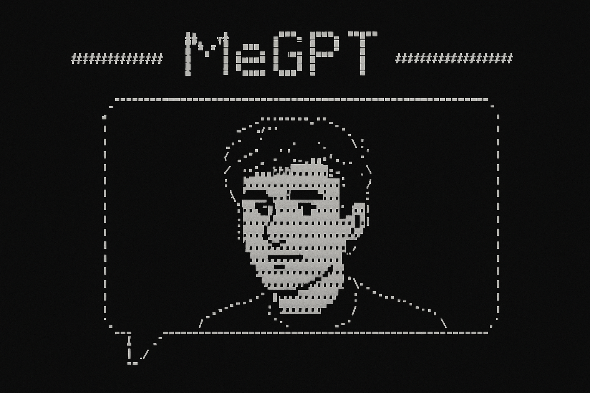

<div align="center">

  
  
</div>

# MeGPT
## Overview
This project trains a personalized language model on your iMessage data to create a chatbot that mimics your texting style. The pipeline extracts messages from your iMessage database, preprocesses them into conversation chunks, fine-tunes a Llama model with LoRA, and serves it via a web interface.

**⚠️ WARNING**: Be extremely careful moving around your iMessage data. There is likely much information you wouldn't want to be stolen or accidentally made public!

## Setup

### Dependencies
Install the required packages:
```bash
pip install --upgrade transformers accelerate bitsandbytes peft datasets "uvicorn[standard]" fastapi streamlit torch tqdm wandb
```

## Usage

### 1. Extract Messages from iMessage Database
Extract all one-on-one text messages from your iMessage database:

```bash
python extract.py --db ~/Library/Messages/chat.db --out messages/all_messages.jsonl
```

- `--db`: Path to your iMessage database (default: `~/Library/Messages/chat.db`)
- `--out`: Output JSONL file (default: `messages/all_messages.jsonl`)

**Note**: You may need to make a copy of your iMessage database in a new location if permission errors occur. Make sure Messages app is closed before running.

### 2. Preprocess Data for Training
Convert raw messages into conversation chunks suitable for training:

```bash
python prep.py --input messages/all_messages.jsonl --output train.jsonl --model_name unsloth/Llama-3.2-3B-bnb-4bit
```

- `--input`: Path to extracted messages JSONL file
- `--output`: Output training file (default: `train.jsonl`)
- `--model_name`: Tokenizer model to use (default: `unsloth/Llama-3.2-3B-bnb-4bit`)

This script:
- Groups messages by conversation
- Collapses consecutive messages from the same sender
- Adds special tokens for timing (`<|DT_SHORT|>`, `<|DT_LONG|>`) and roles (`<|ME|>`, `<|OTHER|>`)
- Chunks long conversations into 2048-token segments with overlap

### 3. Train the Model
Fine-tune a Llama model on your conversation data using LoRA:

```bash
python train.py --model_id unsloth/Llama-3.2-3B-bnb-4bit --train_file train.jsonl --output_dir outputs --batch_size 2 --epochs 5 --lr 2e-4
```

Key arguments:
- `--model_id`: Base model to fine-tune (default: `unsloth/Llama-3.2-3B-bnb-4bit`)
- `--train_file`: Training data file (default: `train.jsonl`)
- `--output_dir`: Directory to save model checkpoints (default: `outputs`)
- `--batch_size`: Training batch size (default: 2)
- `--epochs`: Number of training epochs (default: 5)
- `--lr`: Learning rate (default: 2e-4)
- `--wandb_project`: Weights & Biases project name (default: `MeGPT`)

The script uses 4-bit quantization with LoRA for memory-efficient training and includes Weights & Biases logging.

### 4. Serve the Model
Start the FastAPI inference server:

```bash
uvicorn inference:app --host 0.0.0.0 --port 8000 --reload
```

Environment variables:
- `BASE_MODEL_ID`: Base model ID (default: `unsloth/Llama-3.2-3B-bnb-4bit`)
- `LORA_WEIGHTS`: Path to fine-tuned weights (default: `outputs/checkpoint-5`)

The server provides a `/generate/` endpoint that accepts:
- `prompt`: Input text
- `max_new_tokens`: Maximum tokens to generate (default: 128)
- `temperature`: Sampling temperature (default: 0.7)
- `top_k`: Top-k sampling (default: 50)
- `top_p`: Top-p sampling (default: 0.95)

### 5. Chat Interface
Launch the Streamlit chat interface:

```bash
streamlit run chat_app.py
```

This provides a user-friendly web interface to chat with your personalized model. The interface connects to the FastAPI server and maintains conversation history.

## Pipeline Summary
1. **Extract** → Extract messages from iMessage database
2. **Prep** → Process into conversation chunks with special tokens
3. **Train** → Fine-tune Llama model with LoRA on your data
4. **Serve** → Start FastAPI inference server
5. **Chat** → Use Streamlit interface to interact with your model

